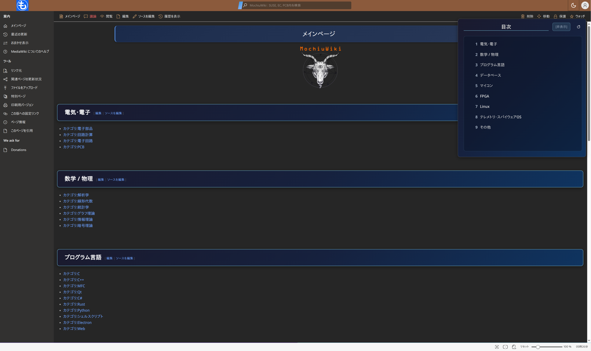
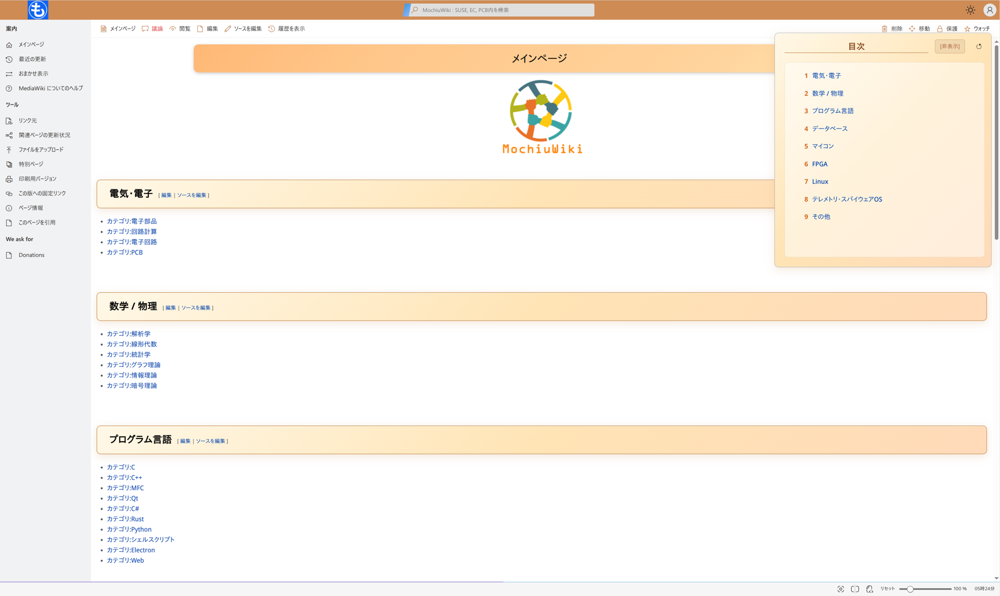

<div align="center">

<b><a href="README.md">English</a> | <a href="README_JP.md">日本語</a></b>

</div>

# Fluent Custom - MediaWiki用カスタマイズFluentスキン

[immewnity/mediawiki-fluent](https://github.com/immewnity/mediawiki-fluent)をベースに大幅なカスタマイズを行った[MediaWikiスキン](https://www.mediawiki.org/wiki/Manual:Skins)です。[MicrosoftのFluent Design System](https://en.wikipedia.org/wiki/Fluent_Design_System)に基づいています。

ダーク/ライトモード切替、ドラッグ&ドロップ対応の目次、画像ポップアップビューア、WikiEditor統合、そして幅広いテーマカスタマイズを追加しています。

## スクリーンショット

| ダークモード | ライトモード |
|:------------:|:------------:|
|  |  |

## 機能

### ダーク / ライトモード切替
- ヘッダーツールバーの手動切替ボタン
- システムカラースキームの自動検出 (`prefers-color-scheme`)
- ユーザー設定を`localStorage`に保存
- テーマ間のスムーズな切替
- `.dark-mode-image` / `.light-mode-image` CSSクラスによるテーマ別画像表示

### 目次 (TOC) の強化
- **ドラッグ&ドロップ** - 画面上の任意の位置に自由に移動可能
- **リサイズ** - 左端または下端をドラッグしてサイズ変更 (最小 200px、最大 50vw / 80vh)
- **最小化 / 復元** - コンパクトなバーに折りたたみ可能
- **状態の永続化** - 位置、サイズ、最小化状態を`localStorage`に保存
- **リセットボタン** - ワンクリックでデフォルトの位置とサイズに復元
- **スマートスクロール** - オフセットを考慮したセクションへのスムーズスクロール

### 画像ポップアップビューア
- コンテンツ内の画像をクリックしてフルスクリーンオーバーレイで表示
- **マウスホイールズーム** 0.5倍から5倍まで (0.1倍刻み)
- **クリック&ドラッグ** でズーム画像をパン操作
- ESCキー、オーバーレイクリック、閉じるボタンで終了
- サムネイルからフルサイズ画像URLを自動解決

### WikiEditor統合
- ソースエディタでの**PageUp / PageDown**キーハンドリング
- 編集時のテキストエリアへの自動フォーカス
- 長い記事の適切なスクロール管理
- VisualEditor (VE) の起動サポート

### テーマシステム
- 400以上のCSSカスタムプロパティ (`--variable-name`) による包括的なテーマ設定
- カスタムアクセントカラー (ライト: `#CF8B54` / ダーク: `#8B5A3C`)
- 検索、ナビゲーション、コンテンツ、エディタ、テーブルの専用カラースキーム
- コードブロック用のシンタックスハイライトカラーテーマ

### 拡張機能との統合
- **Echo** - 通知バッジのスタイリング
- **VisualEditor** - エディタ画面とツールバーの対応

### その他の改善
- 日本語ローカライゼーション (`ja.json`)
- モバイルレスポンシブデザイン (ブレークポイント: 750px)
- Gravatarユーザーアバター対応 (設定可能)
- ブラウザ履歴対応のスマートアンカーナビゲーション
- 印刷用スタイルシート

## インストール

1. このリポジトリをMediaWikiインストールディレクトリの`skins/Fluent`にダウンロードまたはクローンします:
   ```bash
   cd /path/to/mediawiki/skins
   git clone https://github.com/presire/mediawiki-fluent-custom.git Fluent
   ```

2. `LocalSettings.php`に以下の行を追加します:
   ```php
   wfLoadSkin( 'Fluent' );
   ```

3. (任意) Gravatarアバターを無効にする場合:
   ```php
   $wgFluentDisableGravatar = true;
   ```

## 設定

| オプション | 型 | デフォルト | 説明 |
|------------|------|------------|------|
| `$wgFluentDisableGravatar` | boolean | `false` | Gravatarユーザーアバターを無効化 |

## 動作要件

- MediaWiki >= 1.35

## クレジット

- **オリジナルスキン**: [immewnity/mediawiki-fluent](https://github.com/immewnity/mediawiki-fluent) - [Matthew Verive (immewnity)](https://github.com/immewnity) 作
- **カスタマイズ**: [presire](https://github.com/presire)

## ライセンス

[MIT License](LICENSE)
